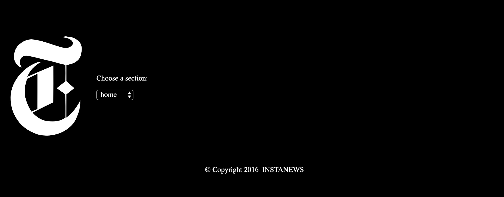

# InstaNews by Jeff Penner

Instanews features an API feed via The New York Times, with the website built using HTML, CSS and JavaScript and jQuery. This site was built based on mock-up photos provided of how the site should appear at 3 different media/screen sizes: 
- mobile, tablet and desktop. 

## Dependencies - Technical Elements

Aspects used to create this website:
Visual Studio Code
Google Chrome Developer Tools
HTML Validator (https://validator.w3.org/nu/#file)
CSS Validator (https://jigsaw.w3.org/css-validator/#validate_by_upload)
HTML
CSS 
JavaScript
jQuery 
SCSS/SASS
AJax
API feed via New York Times
Git/GitHub
Gulp
Browser Sync
Terminal 
Elements and attributes
Doctypes, meta tags and comments
Structure of a webpage knowledge
Form elements
Flexbox
Classes and IDs
Color and backgrounds
CSS "reset" 
Icon Fonts
Developer tools
Responsive Web Design
Mobile-first
CSS3 properties
Operators and Control Flow
Functions

## What I Learned
In this project I learned how to properly execute the connection between jQuery and the Ajax API, as well as the importance of Accessibility (A11Y) and how to properly audit your code for best practices and SEO using Developer Tools. I was able to get the site to have 100% on it's Chrome Developer Tools audit:

## Stretch Goals
1. Each pulled article image is set to display at .85 and to display at 1 when the users hovers their mouse over it (obviously the idea behind this would be exclusive to desktop/mouse users).

Link to the site: hhttps://penner77.github.io/instaNews/
 

